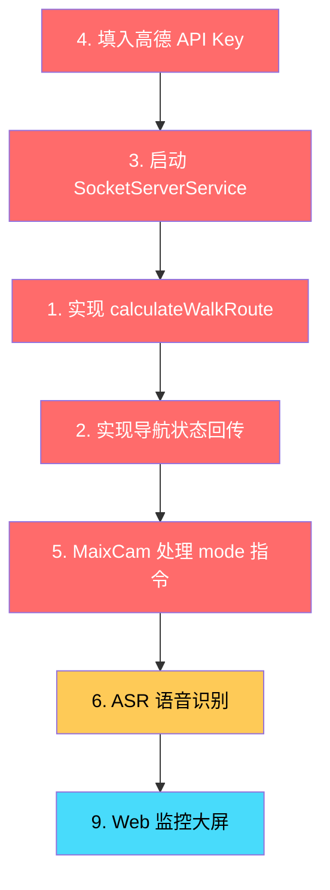

# 🔴 项目端到端串联 — 未完成部分差距分析

## 总览

根据对全部源码的逐行审查，以下是阻碍系统端到端运行的所有未完成项，按优先级排列：

| 优先级 | 含义 |
|--------|------|
| 🔴 P0 | **阻断级** — 不修这个，系统跑不通 |
| 🟡 P1 | **重要** — 系统能跑但功能残缺 |
| 🟢 P2 | **可延后** — 不影响核心流程 |

---

## 🔴 P0: 阻断级问题 (系统跑不通)

### 1. ~~[Android] `calculateWalkRoute()` 未实现 — 导航无法真正启动~~ ✅ 已实现

**文件**: [GaodeNaviManager.java](file:///d:/code/gratitude/phone_agent/app/src/main/java/com/blindnav/agent/navi/GaodeNaviManager.java#L123-L124)

**现状**: 地理编码回调中，拿到经纬度后的关键调用被注释：
```java
// TODO: 拿到坐标后，调用步行算路函数
// calculateWalkRoute(lat, lon);
```

**需要做**:
- 实现 `calculateWalkRoute(double lat, double lon)` 方法
- 使用 `AMapNavi.calculateWalkRoute()` 计算步行路线
- 算路成功后调用 `mAMapNavi.startNavi(NaviType.EMULATOR)` 或 `GPS` 启动导航

---

### 2. ~~[Android] 导航状态回传缺失 — 树莓派永远收不到 `TURN_LEFT/ARRIVED` 等事件~~ ✅ 已实现

**文件**: [GaodeNaviManager.java](file:///d:/code/gratitude/phone_agent/app/src/main/java/com/blindnav/agent/navi/GaodeNaviManager.java)

**现状**: 没有实现 `AMapNaviListener` 的 `onNaviInfoUpdate()` 回调，导航状态无法回传给树莓派。

**需要做**:
- 让 [GaodeNaviManager](file:///d:/code/gratitude/phone_agent/app/src/main/java/com/blindnav/agent/navi/GaodeNaviManager.java#21-253) 实现 `AMapNaviListener`
- 在 `onNaviInfoUpdate(NaviInfo)` 中提取转弯事件和剩余距离
- 通过回调接口将 JSON `{"status":"NAV_ACTIVE","event":"TURN_LEFT","distance":15}` 传给 [SocketServerService](file:///d:/code/gratitude/phone_agent/app/src/main/java/com/blindnav/agent/navi/SocketServerService.java#29-198) 发送
- 在 `onArriveDestination()` 中发送 `{"status":"ARRIVED"}`

---

### 3. ~~[Android] [SocketServerService](file:///d:/code/gratitude/phone_agent/app/src/main/java/com/blindnav/agent/navi/SocketServerService.java#29-198) 从未被启动~~ ✅ 已修复

**文件**: [MainActivity.java](file:///d:/code/gratitude/phone_agent/app/src/main/java/com/blindnav/agent/MainActivity.java)

**现状**: [MainActivity](file:///d:/code/gratitude/phone_agent/app/src/main/java/com/blindnav/agent/MainActivity.java#12-107) 中没有任何代码启动 [SocketServerService](file:///d:/code/gratitude/phone_agent/app/src/main/java/com/blindnav/agent/navi/SocketServerService.java#29-198)。蓝牙服务不运行，树莓派无法连接手机。

**需要做**:
```java
// 在 MainActivity.onCreate() 中添加：
Intent btService = new Intent(this, SocketServerService.class);
startForegroundService(btService);
```

---

### 4. [Android] 高德 API Key 为空

**文件**: [phone_agent/app/src/main/res/values/strings.xml](file:///d:/code/gratitude/phone_agent/app/src/main/res/values/strings.xml) (第85行)

**现状**: `<string name="amap_api_key"></string>` — 空值，高德 SDK 初始化会失败。

**需要做**: 在[高德开放平台](https://console.amap.com/)申请 Android 端 Key，填入该字段。

---

### 5. [MaixCam] 不处理 [mode](file:///d:/code/gratitude/pi_node/core/network_client.py#54-61) 指令 — 导航模式切换失效

**文件**: [network_server.py](file:///d:/code/gratitude/cam_node/core/network_server.py#L29-L51)

**现状**: `NetworkServer._recv_loop()` 只处理 `{"type":"search"}` 消息。树莓派 `NetworkClient.send_mode()` 发送的 `{"type":"mode"}` 指令被直接忽略。

**需要做**:
```python
# 在 _recv_loop() 的 json 解析分支中添加:
elif msg.get("type") == "mode":
    self.current_mode = msg.get("mode", "normal")
    print(f"[Network] Mode switched to: {self.current_mode}")
```
并在 `VisionDetector.run_frame()` 中根据 `server.current_mode` 调整检测策略。

---

## 🟡 P1: 重要功能缺失

### 6. [树莓派] ASR 语音识别未实现 — 无法真正语音交互

**文件**: [audio_engine.py](file:///d:/code/gratitude/pi_node/core/audio_engine.py#L13-L16), [main.py](file:///d:/code/gratitude/pi_node/main.py#L35)

**现状**: `AudioEngine.listen()` 返回空字符串（TODO），[main.py](file:///d:/code/gratitude/pi_node/main.py) 用 `input()` 键盘输入模拟语音。

**需要做** (按 plan.md 的设计):
1. 集成 **Silero VAD** 智能端点检测
2. 接入 ASR 引擎 (Whisper / 百度 / 阿里 STT API)
3. 替换 [main.py](file:///d:/code/gratitude/pi_node/main.py) 中的 `input()` 为 `audio.listen()` 调用

> [!TIP]
> 初期建议先用百度/阿里免费 STT API 快速验证,后续再替换为离线 Whisper。

---

### 7. [树莓派] [pi_node/requirements.txt](file:///d:/code/gratitude/pi_node/requirements.txt) 不完整

**现状**: 只列了 `pybluez`，缺少核心依赖。

**完整依赖应为**:
```
torch
transformers
pybluez
```

---

### 8. [MaixCam] [cam_node/requirements.txt](file:///d:/code/gratitude/cam_node/requirements.txt) 为空

**现状**: 文件存在但内容为空。MaixCam 依赖 [maix](file:///d:/code/gratitude/pi_node/core/navigator.py#56-59) 库（系统预装），但应该至少记录下来。

---

## 🟢 P2: 可延后项

### 9. Web 云端监控大屏未实现

**来源**: [plan.md](file:///d:/code/gratitude/plan.md) 阶段四

**设计目标**: FastAPI + SQLite + Vue.js + ECharts，展示 GPS 轨迹、障碍物统计、设备状态。

**现状**: 完全未开工，无任何代码。

---

### 10. [pyproject.toml](file:///d:/code/gratitude/pyproject.toml) 入口点错误

**现状**: `gratitude-run = "main:main"` 指向不存在的根模块。实际代码分布在 `cam_node/` 和 `pi_node/`，分别独立部署到不同硬件。

**建议**: 要么删除入口点，要么改为各节点独立的 setup.cfg。

---

## 建议修复顺序



> [!IMPORTANT]
> **最小可运行路径**: 先修 P0 的 1-5 项（约 200 行代码改动），系统就能端到端跑通 "说目的地 → 手机导航 → 转弯播报 → 到达" 的核心流程。

## 验证方案

### 端到端验证 (需要真实硬件)
1. 连接 MaixCam + 树莓派 (USB)，启动 [cam_node/main.py](file:///d:/code/gratitude/cam_node/main.py) 和 [pi_node/main.py](file:///d:/code/gratitude/pi_node/main.py)
2. 在 Pi 终端输入 "导航去文三路地铁站"
3. 验证手机自动启动高德步行导航
4. 验证树莓派收到转弯事件并 TTS 播报
5. 验证 MaixCam 收到 mode 切换指令

### 分层验证 (可在开发机上做)
- **TCP 通信**: 用 [test/test_server.py](file:///d:/code/gratitude/test/test_server.py) 模拟 MaixCam，验证 Pi 连接
- **蓝牙通信**: 手动在 Pi 上运行 [PhoneComm](file:///d:/code/gratitude/pi_node/core/phone_comm.py#9-109), 检查与手机 BT 配对
- **LLM 意图**: 单独运行 `LLMEngine.parse_command()` 测试不同语音输入
